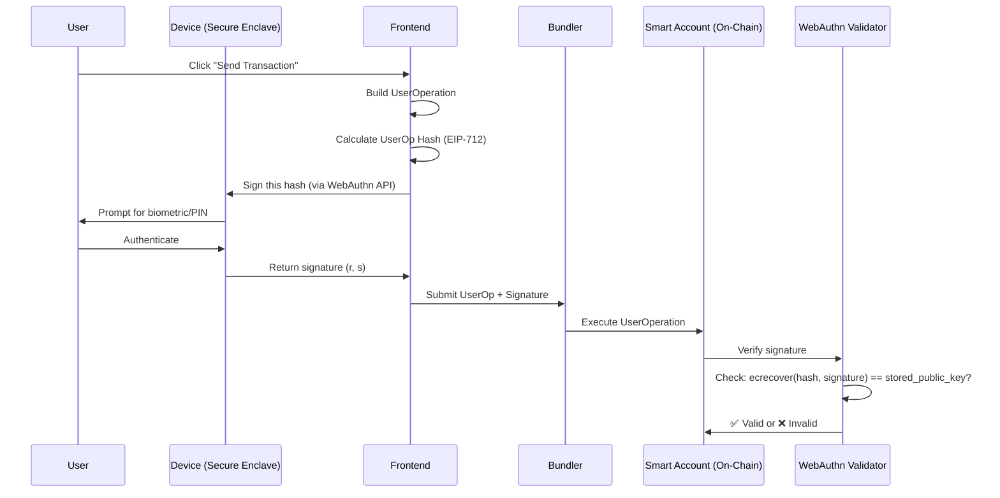

# Integrating Smart Accounts with Passkeys

This guide explains how the SSO Interop Portal integrates smart contract accounts and passkeys on ZKsync. It provides step-by-step instructions for an AI agent or developer to replace browser-based EOA wallets with passkey-powered smart accounts.

## Technology Stack & Versions

> ⚠️ **Important**: This project uses a **Beta** version of the ZKsync SSO SDK. Ensure you use the exact version to avoid breaking changes.

-   **`zksync-sso`**: `1.0.0-beta.4`
-   **`viem`**: `^2.44.4`
-   **`@matterlabs/zksync-js`**: Used in backend for ZKsync-specific client interactions.

---

## Architecture Overview

The system replaces traditional private keys with hardware-secured **Passkeys** (WebAuthn).

1.  **Passkey**: A cryptographic key pair generated by the user's device.
2.  **Smart Account**: A modular contract-based wallet (ERC-4337 + ERC-7579).
3.  **Backend Service**: Essential for "counterfactual" deployment. It deploys the account and pays for initial initialization so the user doesn't need ETH upfront.

---

## How Passkeys Link to Smart Accounts

This is the most important concept to understand: **the passkey's public key is stored inside the smart account contract**.

### The Cryptographic Binding

When you create a passkey using WebAuthn:

1. **Your device generates an ECDSA key pair** (specifically, a secp256r1/P-256 elliptic curve key pair)
2. **The private key** is stored in the device's secure enclave (Secure Element, TPM, etc.) and **NEVER leaves the device**
3. **The public key** is returned to the application in COSE format (a binary encoding standard)

The "linking" happens during smart account deployment:

```typescript
// Frontend: Extract the public key from the passkey
const result = await registerNewPasskey({ userName: "alice" });
// result.credentialPublicKey contains the ECDSA public key in COSE format

// Backend: Extract x,y coordinates from the COSE public key
const [xBytes, yBytes] = getPublicKeyBytesFromPasskeySignature(new Uint8Array(credentialPublicKey));

// Backend: Deploy the smart account with these coordinates STORED IN THE CONTRACT
const webauthnInitData = encodeAbiParameters(
  parseAbiParameters("bytes, bytes32[2], string"),
  [credentialIdHex, [x, y], originDomain]  // ← The public key is here!
);

// This initialization data is sent to the WebAuthnValidator module
// The module STORES these coordinates in the smart account's storage
```

### What Gets Stored On-Chain

The smart account contract stores:
- **Public Key Coordinates**: `x` and `y` (32 bytes each) - these uniquely identify your passkey
- **Credential ID**: A reference identifier for the passkey
- **Origin Domain**: The website/app that created the passkey (security measure)

### How Transaction Signing Works

When you sign a transaction:



**The key security property**: The on-chain validator performs elliptic curve signature verification using the **public key coordinates stored during deployment**. If the signature doesn't match, the transaction is rejected.

### Why This is Secure

- **No private key exposure**: The private key never leaves the secure hardware
- **Deterministic account address**: The account address is derived from `keccak256(credentialId)`, making it predictable before deployment
- **Signature verification on-chain**: The WebAuthn validator contract uses the P-256 elliptic curve precompile to verify signatures
- **Bound to device**: Only the device that created the passkey can sign transactions

### Code Flow Summary

1. **Passkey Creation** (Client): Device generates key pair → Returns public key to app
2. **Account Deployment** (Backend): Extract `(x, y)` from public key → Deploy contract with these coordinates stored in WebAuthnValidator
3. **Transaction Signing** (Client): Device signs hash with private key → Returns signature `(r, s)`
4. **Verification** (On-Chain): WebAuthnValidator checks `ecrecover(hash, r, s) == (x, y)`

---

## Backend Implementation Guide

A backend is required because smart accounts need to be deployed and initialized on-chain before they can be used. Since a new user has no ETH, the backend acts as a **Relayer/Deployer**.

### 1. Backend Project Setup
Initialize a Node.js project with Express and the following dependencies:
```bash
npm install express viem zksync-sso@1.0.0-beta.4 @matterlabs/zksync-js cors dotenv
```

### 2. Configure the Deployer Wallet
The backend needs a funded EOA (Private Key) to pay for account deployments.
```typescript
// utils/client.ts
import { createPublicClient, createWalletClient, http } from "viem";
import { privateKeyToAccount } from "viem/accounts";

const account = privateKeyToAccount(process.env.PRIVATE_KEY as `0x${string}`);
export const l2Wallet = createWalletClient({
  account,
  transport: http(RPC_URL),
});
```

### 3. Create the Deployment Logic
The core function extracts the public key from the passkey and calls the SSO Factory.

```typescript
import { base64UrlToUint8Array, getPublicKeyBytesFromPasskeySignature } from "zksync-sso/utils";
import { encodeAbiParameters, parseAbiParameters, keccak256, toHex } from "viem";

export async function deploySmartAccount(originDomain: string, credentialId: string, credentialPublicKey: number[]) {
  // 1. Extract coordinates (x, y) from the COSE public key
  const [xBytes, yBytes] = getPublicKeyBytesFromPasskeySignature(new Uint8Array(credentialPublicKey));
  const x = toHex(xBytes);
  const y = toHex(yBytes);

  // 2. Prepare Initialization Data for WebAuthn Validator
  const credentialIdHex = toHex(base64UrlToUint8Array(credentialId));
  const webauthnInitData = encodeAbiParameters(
    parseAbiParameters("bytes, bytes32[2], string"),
    [credentialIdHex, [x, y], originDomain]
  );

  // 3. Deploy via SSO Factory
  const accountId = keccak256(credentialIdHex);
  const hash = await l2Wallet.writeContract({
    address: SSO_FACTORY_ADDRESS,
    abi: FACTORY_ABI,
    functionName: "deployAccount",
    args: [accountId, "0x"], // Deploy first
  });
  
  // 4. Initialize with Validator (Simplified)
  // Check backend/src/utils/accounts/deploy-account.ts for the full retry/wait logic
}
```

### 4. Required API Endpoints

Your backend must expose at least one endpoint:

#### `POST /deploy-account`
- **Request Body**:
  ```json
  {
    "originDomain": "https://yourapp.com",
    "credentialId": "...",
    "credentialPublicKey": [...]
  }
  ```
- **Action**: Calls the `deploySmartAccount` logic and returns the newly created `accountAddress`.

---

## Client-side Integration Steps

### 1. Generating a Passkey
```typescript
import { registerNewPasskey } from "zksync-sso/client/passkey";

async function createPasskey(userName: string) {
  const result = await registerNewPasskey({
    userName: userName,
    userDisplayName: userName,
  });

  // MUST send result.credentialId and result.credentialPublicKey to your backend
  return result;
}
```

### 2. Constructing and Signing Transactions (ERC-4337)
Instead of standard transactions, build a `UserOperation`.

```typescript
import { requestPasskeyAuthentication } from "zksync-sso/client/passkey";

// 1. Sign the UserOp hash with the passkey
const passkeySignature = await requestPasskeyAuthentication({
  challenge: userOpHash, // Calculated via EIP-712
  credentialPublicKey: new Uint8Array(storedPublicKey),
});

// 2. Submit to Bundler
// See frontend/src/utils/sso/sendTxWithPasskey.ts for the full v0.8 packing logic
```

## Summary of Files in this Example

-   `frontend/src/utils/sso/passkeys.ts`: Logic for creating and saving passkeys.
-   `frontend/src/utils/sso/sendTxWithPasskey.ts`: Logic for building UserOps and signing them.
-   `backend/src/utils/accounts/deploy-account.ts`: Logic for actual contract deployment on ZKsync.
